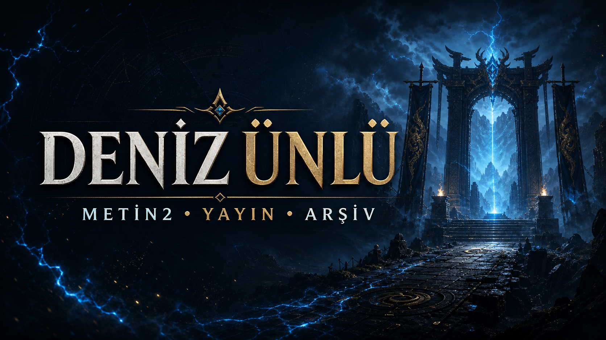

# Deniz Ünlü Creator Platform

Deniz Ünlü için geliştirilen; canlı yayın bağlantılarını, güncel videoları,
yayın arşivini, Metin2 sunucularını, çekilişleri ve topluluk etkileşimini tek
merkezde birleştiren full-stack içerik platformu.




## Proje özeti

Bu proje, içerik üreticisinin kanal veya yayın platformu değiştiğinde kod
değişikliği gerektirmeden güncellenebilen gerçek bir yönetim deneyimi sunar.
YouTube ve Dailymotion içerikleri otomatik alınır; ziyaretçiler videoları
platformdan ayrılmadan izleyebilir.

### Öne çıkan özellikler

- Güncel YouTube kanalından otomatik video akışı
- Dailymotion profilinden otomatik yayın arşivi
- Kick, Discord, WhatsApp ve canlı yayın bağlantılarının panelden yönetimi
- Aktif Metin2 sunucularını ekleme, sıralama ve yayından kaldırma
- 50 katılımcıda sonuçlanan, yönetilebilir 1.000 EP çekiliş sistemi
- Üyeliksiz paylaşım, dil filtresi, sayfalama ve yönetici moderasyonu
- Cloudflare Turnstile ile bot ve spam koruması
- Mobil, tablet ve masaüstü için responsive arayüz
- Hareket azaltma tercihini destekleyen animasyonlar
- Arama motorları ve sosyal paylaşım için metadata, sitemap ve OG görseli

## Teknik yapı

| Katman | Teknoloji |
| --- | --- |
| Arayüz | React 19, Next.js 16, TypeScript |
| Sunucu | Next.js API rotaları, Vinext |
| Veri | Cloudflare D1, Drizzle ORM |
| Güvenlik | Turnstile doğrulaması, yönetici e-posta izin listesi |
| İçerik kaynakları | YouTube, Dailymotion |
| Yayın altyapısı | Cloudflare tabanlı edge çalışma ortamı |

Yönetilebilir içerik, çekiliş katılımları ve topluluk mesajları D1 üzerinde
saklanır. Video dosyaları projeye veya sunucuya yüklenmez; YouTube ve
Dailymotion oynatıcıları üzerinden sunulur. Böylece depolama maliyeti ve bakım
yükü düşük tutulur.

## Başlıca sayfalar

- `/` — ana sayfa ve hızlı erişim merkezi
- `/videolar` — güncel YouTube videoları
- `/arsiv` — Dailymotion yayın arşivi
- `/sunucular` — aktif Metin2 sunucuları
- `/cekilis` — çekiliş katılımı ve sonuç ekranı
- `/topluluk` — fikir, öneri ve tartışma panosu
- `/admin` — içerik, sunucu, çekiliş ve topluluk yönetimi

## Yerel geliştirme

Node.js `22.13.0` veya daha yeni bir sürüm gerekir.

```bash
npm install
copy .env.example .env.local
npm run dev
```

Uygulama varsayılan olarak `http://localhost:3000` adresinde açılır.

Üretim derlemesini ve HTML davranış testlerini çalıştırmak için:

```bash
npm test
```

## Ortam ayarları

Gerekli değişkenler [.env.example](.env.example) içinde belgelenmiştir.
Gerçek `.env` dosyaları, yönetici bilgileri ve Turnstile Secret Key hiçbir
zaman Git deposuna eklenmez.

## Güvenlik yaklaşımı

- Turnstile tokenı sunucu tarafında doğrulanır.
- Yönetim işlemleri izin verilen e-posta hesabıyla sınırlandırılır.
- Ziyaretçi girdileri sunucu tarafında kontrol edilir.
- Gizli anahtarlar yalnızca yerel veya üretim ortam değişkenlerinde tutulur.
- Arşiv medyası harici video platformlarından gömülü oynatıcıyla sunulur.

## Geliştirici

**Tamer Özata** — Yazılım Mühendisliği Öğrencisi<br>
[GitHub profili](https://github.com/frontbackstackdeveloper)

> Proje, Deniz Ünlü'nün içerik ve topluluk ihtiyaçlarına göre özel olarak
> tasarlanmış ve geliştirilmiştir.
